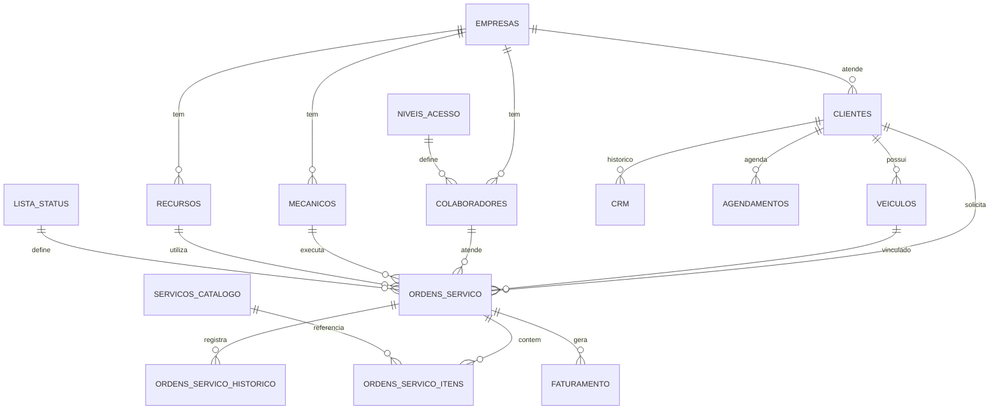

# Doctor Auto - Mapeamento de Tabelas x Telas

## Resumo das Tabelas

| # | Tabela | Descrição | Registros |
|---|--------|-----------|-----------|
| 00 | empresas | Empresas do grupo | 3 |
| 01 | colaboradores | Funcionários (Direção, Gestão, Consultores) | 8 |
| 02 | mecanicos | Mecânicos das oficinas | 12 |
| 03 | recursos | Elevadores, Boxes, Equipamentos | 19 |
| 04 | niveis_acesso | Níveis de permissão do sistema | 6 |
| 05 | clientes | Clientes cadastrados | 1 |
| 06 | veiculos | Veículos dos clientes | 2 |
| 07 | ordens_servico | Ordens de serviço principais | 0 |
| 08 | crm | Dados de relacionamento com cliente | 0 |
| 09 | ordens_servico_historico | Histórico de alterações nas OS | 0 |
| 10 | ordens_servico_itens | Itens/serviços detalhados da OS | 0 |
| 11 | analise_promocoes | Análise de promoções | 0 |
| 12 | lista_status | Status possíveis das OS | 9 |
| 13 | agendamentos | Agendamentos de serviços | 0 |
| 14 | faturamento | Faturamento/Financeiro | 0 |
| 15 | servicos_catalogo | Catálogo de serviços | 0 |

---

## Detalhamento por Tabela

### 00_EMPRESAS
**Descrição:** Empresas do grupo Doctor Auto

**Campos:**
- id, razaoSocial, nomeEmpresa, cnpj, telefone

**Dados atuais:**
- Doctor Auto Prime
- Doctor Auto Bosch (Pombal)
- Garage 347

**Telas que usam:**
- `/admin` - AdminDashboard (seletor de empresa)
- `/admin/overview` - AdminDashboardOverview (filtro por empresa)
- `/admin/configuracoes` - Configurações (gestão de empresas)

---

### 01_COLABORADORES
**Descrição:** Funcionários das empresas (Direção, Gestão, Consultores Técnicos)

**Campos:**
- id, empresaId, nome, cargo, email, telefone, cpf, senha, primeiroAcesso, nivelAcessoId

**Dados atuais:**
- Thalles (Direção), Sofia (Direção)
- Francisco (Gestão), Márcia (Gestão)
- Pedro, João, Rony, Antônio (Consultor Técnico)

**Telas que usam:**
- `/login` - Login (autenticação)
- `/trocar-senha` - Troca de senha
- `/admin` - AdminDashboard (info do usuário logado)
- `/admin/agenda-mecanicos` - AdminAgendaMecanicos (atribuição)
- `/admin/configuracoes` - Configurações (gestão de colaboradores)

---

### 02_MECANICOS
**Descrição:** Mecânicos das oficinas

**Campos:**
- id, empresaId, nome, email, telefone, cpf, grauConhecimento, especialidade, qtdePositivos, qtdeNegativos, ativo

**Dados atuais:**
- Tadeu, João, Pedro, Aldo, Samuel, Wendel, Alexandre, Léo, Rogério, Matheus, Gabriel, Alessandro

**Telas que usam:**
- `/admin/agenda-mecanicos` - AdminAgendaMecanicos (agenda por mecânico)
- `/admin/analytics-mecanicos` - AdminMechanicAnalytics (performance)
- `/admin/feedback-mecanicos` - AdminMechanicFeedback (avaliações)
- `/admin/produtividade` - AdminProdutividade (métricas)
- `/admin/painel-tv` - AdminPainelTV (status em tempo real)
- `/admin/os/:id` - AdminOSDetalhes (atribuição de mecânico)

---

### 03_RECURSOS
**Descrição:** Recursos da oficina (Elevadores, Boxes, Equipamentos)

**Campos:**
- id, empresaId, nomeRecurso, ultimaManutencao, horasUtilizadasMes, valorProduzidoMes, ativo

**Dados atuais:**
- Elevadores 1-9, Boxes 1-5, Rampa, Dinamômetro, VCDS, Remap, Vagas Extras

**Telas que usam:**
- `/admin/operacional` - AdminOperacional (ocupação de recursos)
- `/admin/patio` - AdminPatio (alocação de veículos)
- `/admin/produtividade` - AdminProdutividade (utilização)

---

### 04_NIVEIS_ACESSO
**Descrição:** Níveis de permissão do sistema

**Campos:**
- id, tipoUsuario, nivelAcesso, permissoes

**Dados atuais:**
- Direção (acesso total)
- Gestão (acesso aos painéis das 3 empresas)
- Consultor Técnico (acesso à oficina vinculada)
- Mecânico (sem acesso)
- Cliente (acesso à própria página)
- Terceirizado (sem acesso por padrão)

**Telas que usam:**
- `/login` - Login (verificação de permissão)
- Todas as telas admin (controle de acesso)
- `/admin/configuracoes` - Configurações (gestão de níveis)

---

### 05_CLIENTES
**Descrição:** Clientes cadastrados

**Campos:**
- id, empresaId, nomeCompleto, cpf, email, telefone, dataNascimento, endereco, cep, cidade, estado, origemCadastro, senha, primeiroAcesso

**Dados atuais:**
- Nelson Volpato (exemplo)

**Telas que usam:**
- `/admin/clientes` - AdminClientes (listagem e cadastro)
- `/admin/nova-os` - AdminNovaOS (seleção de cliente)
- `/admin/ordens-servico` - AdminOrdensServico (filtro por cliente)
- `/admin/os/:id` - AdminOSDetalhes (dados do cliente)
- Visão Cliente (área do cliente)

---

### 06_VEICULOS
**Descrição:** Veículos dos clientes

**Campos:**
- id, clienteId, placa, marca, modelo, versao, ano, combustivel, ultimoKm, kmAtual, origemContato

**Dados atuais:**
- ERR1B44 - VW Passat CC 3.6 FSI (Nelson)
- ERR4E88 - VW Passat 2.0T FSI (Nelson)

**Telas que usam:**
- `/admin/clientes` - AdminClientes (veículos do cliente)
- `/admin/nova-os` - AdminNovaOS (seleção de veículo)
- `/admin/ordens-servico` - AdminOrdensServico (info do veículo)
- `/admin/os/:id` - AdminOSDetalhes (dados do veículo)
- `/admin/patio` - AdminPatio (veículos no pátio)
- Visão Cliente (meus veículos)

---

### 07_ORDENS_SERVICO
**Descrição:** Ordens de serviço principais

**Campos:**
- id, numeroOs, dataEntrada, dataSaida, clienteId, veiculoId, placa, km, status, colaboradorId, mecanicoId, recursoId, veioDePromocao, motivoVisita, totalOrcamento, valorTotalOs, primeiraVez, observacoes

**Telas que usam:**
- `/admin/ordens-servico` - AdminOrdensServico (listagem principal)
- `/admin/nova-os` - AdminNovaOS (criação)
- `/admin/os/:id` - AdminOSDetalhes (detalhes completos)
- `/admin/patio` - AdminPatio (OS em andamento)
- `/admin/patio/:id` - AdminPatioDetalhes (detalhes no pátio)
- `/admin` - AdminDashboard (estatísticas)
- `/admin/financeiro` - AdminFinanceiro (faturamento)
- `/admin/painel-tv` - AdminPainelTV (status em tempo real)

---

### 08_CRM
**Descrição:** Dados de relacionamento com cliente

**Campos:**
- id, clienteId, marcaCarro, modeloCarro, tipoServico1-3, ultimaQuilometragem, ultimaPassagem, totalPassagens, totalGasto, comoConheceu, nivelFidelidade, pontosFidelidade, cashbackDisponivel

**Telas que usam:**
- `/admin/clientes` - AdminClientes (histórico do cliente)
- `/admin` - AdminDashboard (métricas de fidelidade)
- Relatórios

---

### 09_ORDENS_SERVICO_HISTORICO
**Descrição:** Histórico de alterações nas OS

**Campos:**
- id, ordemServicoId, statusAnterior, statusNovo, colaboradorId, observacao, dataAlteracao

**Telas que usam:**
- `/admin/os/:id` - AdminOSDetalhes (timeline de alterações)
- Relatórios

---

### 10_ORDENS_SERVICO_ITENS
**Descrição:** Itens/serviços detalhados da OS

**Campos:**
- id, ordemServicoId, tipo, descricao, quantidade, valorUnitario, valorTotal, aprovado, executado, mecanicoId

**Telas que usam:**
- `/admin/os/:id` - AdminOSDetalhes (lista de itens)
- `/admin/financeiro` - AdminFinanceiro (detalhamento)

---

### 11_ANALISE_PROMOCOES
**Descrição:** Análise de promoções

**Campos:**
- id, dataPromocao, nomePromocao, clienteId, veioPelaPromocao, clienteRetornou, quantasVezesRetornou, totalGasto

**Telas que usam:**
- `/admin` - AdminDashboard (métricas de promoções)
- Relatórios

---

### 12_LISTA_STATUS
**Descrição:** Status possíveis das OS

**Campos:**
- id, status, ordem, cor, ativo

**Dados atuais:**
1. Diagnóstico (#3B82F6)
2. Orçamento (#8B5CF6)
3. Aguardando Aprovação (#F59E0B)
4. Aguardando Peça (#EF4444)
5. Pronto para Iniciar (#10B981)
6. Em Execução (#06B6D4)
7. Pronto (#22C55E)
8. Aguardando Retirada (#84CC16)
9. Entregue (#6B7280)

**Telas que usam:**
- `/admin/ordens-servico` - AdminOrdensServico (filtro e badges)
- `/admin/os/:id` - AdminOSDetalhes (mudança de status)
- `/admin/patio` - AdminPatio (kanban por status)
- `/admin/operacional` - AdminOperacional (visão por etapa)

---

### 13_AGENDAMENTOS
**Descrição:** Agendamentos de serviços

**Campos:**
- id, clienteId, veiculoId, dataAgendamento, horaAgendamento, motivoVisita, status, colaboradorId, observacoes

**Telas que usam:**
- `/admin/agendamentos` - AdminAgendamentos (calendário)
- `/admin` - AdminDashboard (agendamentos do dia)
- `/admin/painel-tv` - AdminPainelTV (próximos agendamentos)

---

### 14_FATURAMENTO
**Descrição:** Faturamento/Financeiro

**Campos:**
- id, ordemServicoId, clienteId, dataEntrega, valor, formaPagamento, parcelas, observacoes

**Telas que usam:**
- `/admin/financeiro` - AdminFinanceiro (relatórios financeiros)
- `/admin` - AdminDashboard (faturamento do mês)
- `/admin/overview` - AdminDashboardOverview (métricas)

---

### 15_SERVICOS_CATALOGO
**Descrição:** Catálogo de serviços

**Campos:**
- id, nome, descricao, tipo, valorBase, tempoEstimado, ativo

**Telas que usam:**
- `/admin/servicos` - AdminServicos (gestão do catálogo)
- `/admin/nova-os` - AdminNovaOS (seleção de serviços)
- `/admin/os/:id` - AdminOSDetalhes (adicionar serviços)

---

## Diagrama de Relacionamentos

---

## Próximos Passos

1. **Você edita os dados** pelo painel Database do Manus
2. **Me avisa** qual tela quer conectar primeiro
3. **Eu conecto** os dados com a tela
4. **Repetimos** até todas as telas estarem funcionando
