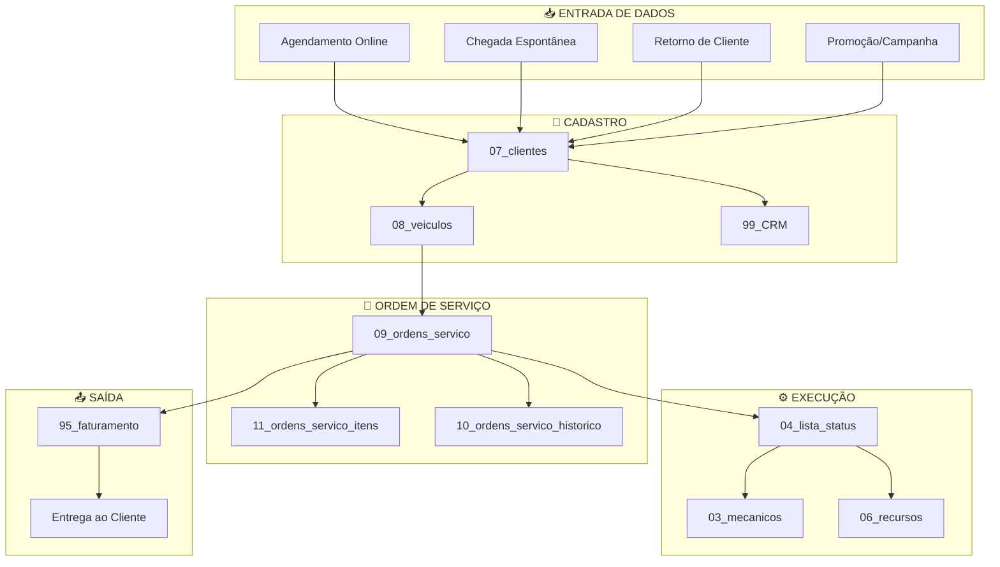

# Relatório de Regras de Cadastro - Doctor Auto Prime

## Visão Geral do Sistema

O sistema Doctor Auto Prime utiliza um banco de dados relacional com as seguintes tabelas principais organizadas por prefixo numérico para facilitar a gestão:

| Prefixo | Tabela | Descrição |
|---------|--------|-----------|
| 00 | empresas | Empresas do grupo |
| 01 | colaboradores | Funcionários (Direção, Gestão, Consultores) |
| 02 | nivelDeAcesso | Níveis de permissão do sistema |
| 03 | mecanicos | Mecânicos das oficinas |
| 04 | lista_status | Status possíveis das OS |
| 05 | pendencias | Pendências da equipe |
| 06 | recursos | Elevadores, Boxes, Equipamentos |
| 07 | clientes | Clientes cadastrados |
| 08 | veiculos | Veículos dos clientes |
| 09 | ordens_servico | Ordens de Serviço principais |
| 10 | ordens_servico_historico | Histórico de alterações nas OS |
| 11 | ordens_servico_itens | Itens/serviços de cada OS |
| 12 | agendamentos | Agendamentos de serviços |
| 95 | faturamento | Dados financeiros |
| 97 | ANALISE_PROMOCOES | Análise de promoções |
| 98 | SERVICOS | Catálogo de serviços |
| 99 | CRM | Dados de relacionamento com cliente |

---

## Fluxo de Dados - Diagrama Mermaid



---

## Regras de Cadastro por Tabela

### 07_clientes (Clientes)

**Gatilho para ABRIR (criar registro):**
- Nova OS criada com cliente não cadastrado
- Agendamento com cliente novo
- Cadastro manual pelo consultor
- Importação de base externa

**Gatilho para FECHAR (inativar):**
- Não há exclusão física, apenas lógica
- Cliente pode ser marcado como inativo após 2 anos sem retorno

**Campos obrigatórios:**
- `nomeCompleto` (obrigatório)
- `telefone` (recomendado para contato)

**Origem dos dados:**
- Tela: AdminNovaOS, AdminClientes
- API: Formulário de agendamento online
- Importação: CSV/Excel

---

### 08_veiculos (Veículos)

**Gatilho para ABRIR:**
- Criação de OS com veículo novo
- Cadastro manual vinculado a cliente existente

**Gatilho para FECHAR:**
- Veículo vendido (marcado como inativo)
- Veículo duplicado (merge com outro registro)

**Campos obrigatórios:**
- `clienteId` (obrigatório - vínculo com cliente)
- `placa` (obrigatório)

**Regras de negócio:**
- Um veículo pertence a apenas um cliente
- Placa deve ser única no sistema
- KM atual deve ser >= KM anterior

**Origem dos dados:**
- Tela: AdminNovaOS (ao criar OS)
- Consulta: API de placas (FIPE, Denatran)

---

### 09_ordens_servico (Ordens de Serviço)

**Gatilho para ABRIR:**
1. **Agendamento confirmado** → Status inicial: "agendado"
2. **Chegada espontânea** → Status inicial: "diagnostico"
3. **Retorno de cliente** → Status inicial: "diagnostico"
4. **Promoção/Campanha** → Status inicial: "diagnostico" + flag `veioDePromocao = true`

**Gatilho para FECHAR:**
1. **Entrega ao cliente** → Status: "entregue" + `dataSaida` preenchida
2. **Cancelamento** → Status: "cancelado" + `motivoRecusa` preenchido

**Fluxo de Status (04_lista_status):**
```
1. Diagnóstico → 2. Orçamento → 3. Aguardando Aprovação → 
4. Aguardando Peças → 5. Pronto para Iniciar → 6. Em Execução → 
7. Teste → 8. Pronto para Entrega → 9. Entregue
```

**Campos obrigatórios:**
- `clienteId` ou dados do cliente
- `veiculoId` ou `placa`
- `descricaoProblema`
- `colaboradorId` (consultor responsável)

**Regras de negócio:**
- Número da OS gerado automaticamente (formato: ANO + sequencial)
- `dataEntrada` preenchida automaticamente ao criar
- `dataConclusao` preenchida ao mudar para "pronto"
- `dataSaida` preenchida ao mudar para "entregue"
- Cada mudança de status gera registro em `10_ordens_servico_historico`

**Origem dos dados:**
- Tela: AdminNovaOS (criação)
- Tela: AdminOSDetalhes (edição)
- Tela: AdminPatio (mudança de status via drag-and-drop)

---

### 11_ordens_servico_itens (Itens da OS)

**Gatilho para ABRIR:**
- Consultor adiciona peça/serviço durante orçamento
- Mecânico identifica necessidade adicional durante execução

**Gatilho para FECHAR:**
- Item recusado pelo cliente → `status = "recusado"`
- Item executado → `executado = true`

**Campos obrigatórios:**
- `ordemServicoId` (vínculo com OS)
- `descricao`
- `valorUnitario`

**Regras de negócio:**
- Prioridade: `vermelho` (urgente), `amarelo` (atenção), `verde` (preventivo)
- Status: `pendente` → `aprovado` ou `recusado`
- `valorTotal = quantidade * valorUnitario`
- Margem calculada: `valorUnitario = valorCusto * (1 + margemAplicada/100)`

**Origem dos dados:**
- Tela: AdminOSDetalhes (modal de adicionar item)
- Catálogo: 98_SERVICOS (valores base)

---

### 10_ordens_servico_historico (Histórico)

**Gatilho para ABRIR:**
- Qualquer mudança de status na OS
- Gerado automaticamente pelo sistema

**Campos registrados:**
- `ordemServicoId`
- `statusAnterior`
- `statusNovo`
- `colaboradorId` (quem fez a alteração)
- `observacao` (opcional)
- `dataAlteracao` (automático)

---

### 12_agendamentos

**Gatilho para ABRIR:**
- Cliente agenda pelo site/WhatsApp
- Consultor agenda pelo sistema
- Retorno programado após entrega

**Gatilho para FECHAR:**
- Cliente comparece → Gera OS → Status: "compareceu"
- Cliente não comparece → Status: "nao_compareceu"
- Cancelamento → Status: "cancelado"

**Campos obrigatórios:**
- `dataAgendamento`
- `clienteId` ou dados do cliente

---

### 95_faturamento

**Gatilho para ABRIR:**
- OS muda para status "entregue"
- Gerado automaticamente com valores da OS

**Gatilho para FECHAR:**
- Pagamento confirmado → `status = "pago"`

**Campos registrados:**
- `ordemServicoId`
- `valor` (total da OS)
- `formaPagamento`
- `parcelas`

---

## Pontos de Entrada de Dados Novos

| Origem | Tabelas Afetadas | Gatilho |
|--------|------------------|---------|
| **AdminNovaOS** | clientes, veiculos, ordens_servico | Botão "Criar OS" |
| **AdminOSDetalhes** | ordens_servico_itens, ordens_servico_historico | Adicionar item, mudar status |
| **AdminPatio** | ordens_servico, ordens_servico_historico | Drag-and-drop de cards |
| **AdminAgendamentos** | agendamentos | Novo agendamento |
| **AdminClientes** | clientes, veiculos | Cadastro manual |
| **Importação CSV** | Qualquer tabela | Upload de arquivo |
| **API Externa** | clientes, veiculos, agendamentos | Integração com site/WhatsApp |

---

## Resumo dos Gatilhos

### Para ABRIR (Criar Registro):
1. **Ação do usuário** - Clicar em "Novo", "Criar", "Adicionar"
2. **Fluxo automático** - OS gera histórico, faturamento
3. **Importação** - Upload de CSV/Excel
4. **API** - Integração externa

### Para FECHAR (Finalizar/Inativar):
1. **Mudança de status** - "Entregue", "Cancelado", "Pago"
2. **Inativação manual** - Marcar como inativo
3. **Regra de negócio** - 2 anos sem retorno = inativo

---

*Documento gerado em: 02/02/2026*
*Sistema: Doctor Auto Prime v1.0*
